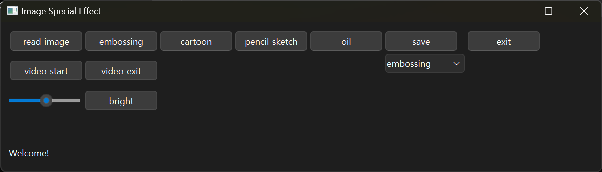
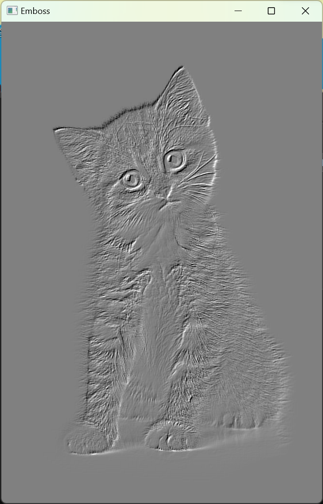

# Special Effect Vision Agent

## Dependencies

이 프로젝트는 poetry, pyenv, windows11 운영체제에서 제작됐습니다.

```toml
python = ">=3.11,<3.14"
pyinstaller = "^6.11.0"
pyqt6 = "^6.7.1"
opencv-contrib-python = "^4.10.0.84"
```

## Install Library

```PowerShell
# poetry
poetry install
```

## How To Use This Application?

* PowerShell
```PowerShell
python <Your_App_Path>
```

* exe file: special_effect_vision_agent.exe

### 1. 처음 화면



초기 화면입니다. 먼저 `read image` 버튼을 눌러 사진을 업로드합니다. 사진이 업로드 되면 `embossing`, `cartoon`, `pencil sketch`, `oil` 버튼으로 특수 효과를 적용할 수 있습니다. 아래는 embossing을 적용한 예시 사진입니다.



웹캠이 활성화 되면 c 버튼을 눌러 화면 캡쳐가 가능하고, q 버튼을 눌러 웹캠을 종료할 수 있습니다.

`video start` 버튼을 누르고, 웹캠에서 동일한 효과를 적용할 수 있습니다.

### 2. 추가 기능: 이미지 밝기 조절

슬라이드바를 좌 우 방향키로 조절하고 `bright` 버튼을 누르면 슬라이드바 값에 따라 밝기가 조절됩니다.